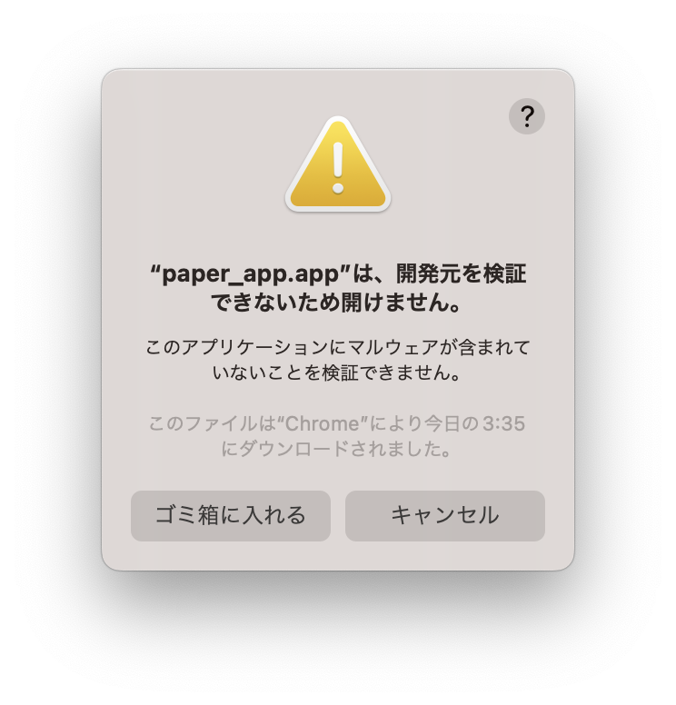
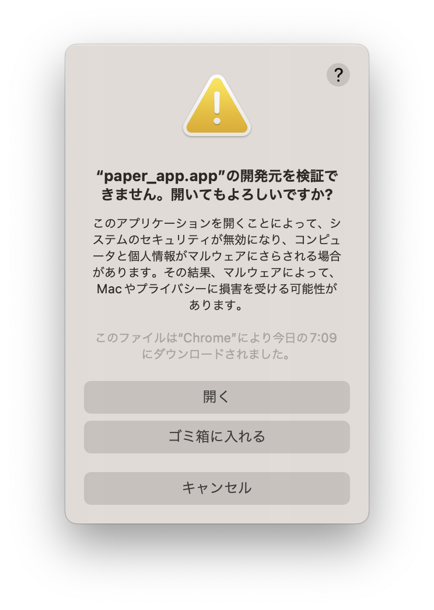

# ダウンロード方法
## アプリのダウンロード

[ダウンロードリンク](https://github.com/SystemEngineeringTeam/geekcamp-caravan-2023-vol2/releases) からダウンロードしてください.
- MacOS: paper_app_0.0.3_x64.dmg
- Windows: paper_app_0.0.3_x64-setup.exe
- Linux(Debian): paper-app_0.0.3_amd64.deb

## 開発元の検証
初回はアプリを開くと以下のようなダイアログが出ます.

`キャンセル` を押したのち, 
> システム設定 > プライバシーとセキュリティ > セキュリティ

から
> “paper_app.app“は開発元を確認できないため、使用がブロックされました

の欄の `このまま開く` を選択してください.

再度ダイアログが開いたら `開く` を選択してください.

## 権限の許可
アプリを開くと マイク や AppleScript の許可が求められるので `OK` を押してください.

